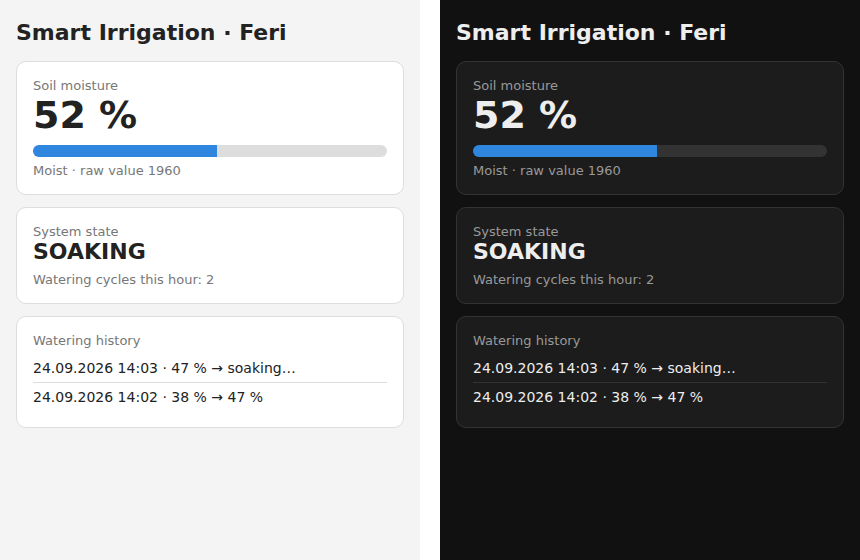
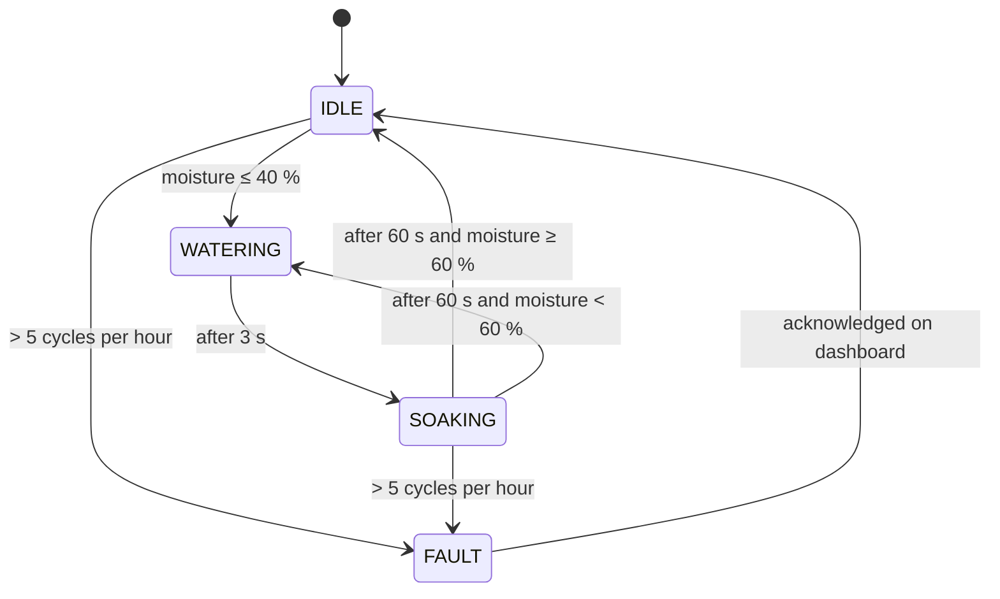
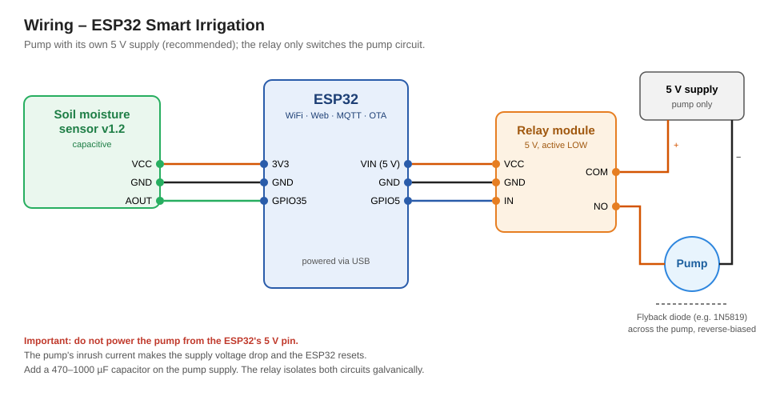

# ESP32 Smart Irrigation System

Automatic plant watering with an ESP32. A capacitive sensor measures soil moisture, and a state machine with hysteresis drives a pump through a relay. A web dashboard shows live values and a watering history, MQTT publishes telemetry, and firmware can be updated over the air. Safety functions switch the pump off on sensor faults or an empty water tank.


*Web dashboard in light and dark mode (test data).*

## Features

- **Soil moisture in %** from calibrated raw values, averaged over 16 readings
- **State machine with hysteresis** (start at 40 %, stop at 60 %) to prevent rapid pump cycling
- **Pulse watering with soak time:** 3 s pump pulse, then 60 s wait so the water can spread before the next decision
- **Safety shutdown:**
  - implausible sensor value (broken wire, short circuit) → pump off, state `FAULT`
  - more than 5 watering cycles per hour (empty tank, sensor not in soil) → pump off, state `FAULT`
  - a fault must be acknowledged on the dashboard
- **Watering history** of the last 10 cycles with timestamp (NTP) and moisture before / after
- **Web dashboard** with light and dark mode, readable on a phone
- **MQTT telemetry** of moisture and state every 5 s
- **OTA updates** (password protected); the pump is switched off during an update
- **Network-independent control:** the control loop keeps running without WiFi, MQTT or NTP

## State machine



In addition, an implausible sensor value leads to `FAULT` from **any** state and switches the pump off immediately.

## Hardware

| Component | Details |
| --- | --- |
| ESP32 dev board | powered via USB |
| Soil moisture sensor | capacitive v1.2 (e.g. Aideepen SE-001) |
| Relay module | 5 V, active LOW |
| Pump | mini submersible pump with PVC tube |
| Pump supply | separate 5 V supply (recommended, see below) |
| Flyback diode | e.g. 1N5819, across the pump |
| Capacitor | 470–1000 µF on the pump supply |

## Wiring



| From | To |
| --- | --- |
| Sensor VCC | ESP32 3V3 |
| Sensor GND | ESP32 GND |
| Sensor AOUT | ESP32 GPIO35 (ADC1) |
| Relay VCC | ESP32 VIN (5 V) |
| Relay GND | ESP32 GND |
| Relay IN | ESP32 GPIO5 |
| Relay COM | pump supply + |
| Relay NO | pump + |
| Pump − | pump supply − |

**Why the capacitor and the diode?**

- **Capacitor:** When the pump starts, it briefly draws several times its rated current. The capacitor supplies this peak from its stored charge so the supply voltage does not collapse.
- **Flyback diode:** The pump motor is an inductive load. When the relay opens, the coil tries to keep the current flowing and produces a high voltage spike. The reverse-biased diode gives this current a path to decay safely instead of causing sparks at the relay and resets of the ESP32.

## Calibration

The sensor's raw value **decreases** as the soil gets wetter.

1. Hold the sensor in air → enter the raw value as `RAW_DRY` (mine: 2680)
2. Put the sensor in water up to the marking → enter the raw value as `RAW_WET` (mine: 1300)

The dashboard shows the raw value below the moisture bar.

## Getting started

1. **Arduino IDE** with the board package **esp32 by Espressif**
2. Install the **PubSubClient** library (Nick O'Leary) via the Library Manager
3. In `firmware/smart_irrigation/`, copy `secrets.example.h`, rename it to `secrets.h` and enter your WiFi credentials and an OTA password
4. Upload via USB, read the IP address in the Serial Monitor (115200 baud) and open it in a browser
5. Later updates can be uploaded over WiFi: the board appears as a network port called `smart-irrigation`

**Test MQTT**, e.g. with `mosquitto_sub`:

```bash
mosquitto_sub -h test.mosquitto.org -t "irrigation/esp32/#" -v
```

`test.mosquitto.org` is a public test broker, so anyone can read these topics. For real use, run your own broker, e.g. Mosquitto on a Raspberry Pi.

## Lessons learned

- **Power supply:** During testing, the ESP32 and its web server crashed when the pump started again. The most likely cause was the pump's inrush current pulling the supply voltage down. Solution: a separate pump supply, a buffer capacitor and a flyback diode.
- **Blocking code is a safety risk:** An earlier version waited in a loop until the MQTT broker was reachable. If the broker had gone down while the pump was running, the pump would never have been switched off. The control loop is now fully non-blocking.
- **Measure at the right time:** Right after a pulse, the sensor sometimes jumped to 100 % because water ran down along it. The "after" value in the history is therefore taken at the end of the soak time.
- **Plan for failure:** Without a cycle limit, an empty tank would make the pump run dry every minute forever. The fault state turns this into a visible, safe condition.

## Future work

- Water level sensor in the tank
- Long-term data logging with charts
- Own MQTT broker and Home Assistant integration
- Multiple plants with individual sensors and valves

## License

MIT, see [LICENSE](LICENSE).
